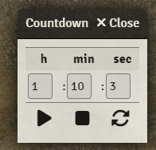
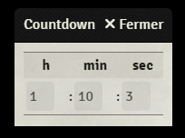
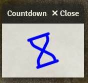

# Simple countdown timer overlay

Allows the GM to get a countdown overlay. The countdown is visible to all client when start.
You can set the countdown up to an hour or more.

To show the countdown , click on hourglass control button in the token menu.

|   |   |
|:---------------:|:---------------:|
| *GM countdown* | *Player countdown* |

 

## Settings
Choose the interval in seconds to synchronisation the remaing time

## Button
### Timer input
Three input to enter the hours, minutes and seconds of remaining time. When the timer is playing and game is not in pause it will decrease each seconds.

### Visibility mode
Choose the visibility mode, from the left to the right : 
1. None : the clients will not see if the countdown start
2. Limited : the clients will see the countdown start but not the remaining time
3. Observer : the clients will see the countdown start and the remaining time

*Limited visibility player view*

### Timer Control
The controls buttons are play, pause and stop (reinit) buttons. The last one is to manually resynchronize the remaining time.

## API
All these methods can also be called with the module's API `game.modules.get("simple-countdown").api` with the same parameters and behavior:
- `xxx.api.init( seconds, isPlaying, visibilityMode )` to generate a new countdown
- `xxx.api.start()` to start the timer of the current countdown
- `xxx.api.pause()` to pause the timer of the current countdown
- `xxx.api.reset()` to reset the current countdown with initial values
- `xxx.api.close()` to close the current countdown
- `xxx.api.updateVisibilityMode( newVisibilityMode )` to change the visibility mode of the current countdown

The module give example for each methods with macros

## Chat commands
The countdown can alse be initialize with the chat command  `/scd init`
This command should be followed by a number representing the seconds of the countdown.
It could contain the option : 
- `--play` to play the countdown at start.
- `--visibility-mode` or `-vm` to choose the visibility mode of the generated countdown.

Example :`/scd init 500 --play -vm none`
