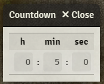

# Simple countdown timer overlay

Allows the GM to get a countdown overlay. The countdown is visible to all client when start.
You can set the countdown up to an hour or more.

To show the countdown , click on control button in the token menu.

You can choose the delta time of synchronization in the settings.

*GM countdown*

*Player countdown*

### Features
- Simple countdown
- Regular synchronisation of the remaing time
- Synchronisation button

### Compatibility:
- Tested with FVTT v9 - v11.
