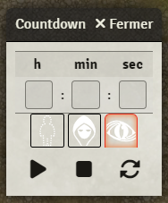

# Simple countdown timer overlay

Allows the GM to get a countdown overlay. The countdown is visible to all client when start.
You can set the countdown up to an hour or more.

To show the countdown , click on hourglass control button in the token menu.

|   |   |
|:---------------:|:---------------:|
| *GM countdown* | *Player countdown* |

 

## Settings
Choose the interval in seconds to synchronisation the remaing time

## Button
### Timer input
Three input to enter the hours, minutes and seconds of remaining time. When the timer is playing and game is not in pause it will decrease each seconds.

### Visibility mode
Choose the visibility mode, from the left to the right : 
1. None : the clients will not see if the countdown start
2. Limited : the clients will see the countdown start but not the remaining time
3. Observer : the clients will see the countdown start and the remaining time

*Limited visibility player view*

### Timer Control
The controls buttons are play, pause and stop (reinit) buttons. The last one is to manually resynchronize the remaining time.

## Compatibility:
- Tested with FVTT v9 - v11.
